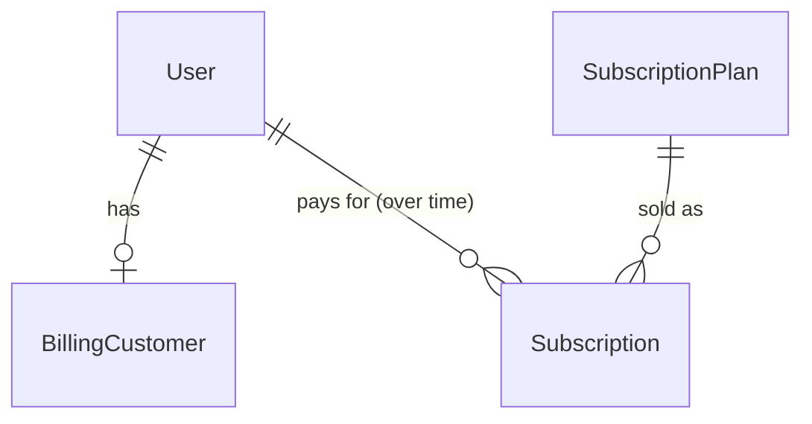

# billing — architecture

Stripe-backed monthly subscriptions and the single entitlement gate the rest of the
system checks before letting a user book a session. `billing` mirrors Stripe's state via
webhooks; it never decides pricing or payment logic itself — Stripe does, and `billing`
records what Stripe reports.

Spec: `docs/superpowers/specs/2026-07-09-billing-subscriptions-design.md` · Status:
shipped (Phase B, B1).

## Data model



- **SubscriptionPlan** — admin-CRUD via Django admin. `plan_type` (`individual` |
  `family`), `sessions_per_cycle` (per-student for Individual, per-child for Family),
  `stripe_price_id` (the recurring Stripe Price — charge source of truth),
  `display_amount` (minor units) + `currency`, `is_active`. Display copy (name,
  description) is **not** stored here — the frontend supplies bilingual copy keyed on
  `plan_type`.
- **BillingCustomer** — `OneToOneField` `user` → `stripe_customer_id`. Created lazily on
  a user's first checkout (`_ensure_customer`), never eagerly.
- **Subscription** — many-over-time per user (`ForeignKey`, not `OneToOne` — a user can
  resubscribe after lapsing). `stripe_subscription_id` (unique), `status` (mirrors
  Stripe: `active` / `past_due` / `canceled` / `incomplete` / `incomplete_expired` /
  `unpaid`), `current_period_end` (nullable — see below), `cancel_at_period_end`.
  Indexed on `(user, status)`. At most one row is *current* per user; that invariant is
  enforced in `services`, not the schema.
- **StripeEventLog** — `stripe_event_id` (unique), `event_type`, `received_at`,
  `processed_at` (nullable). The idempotency ledger: a webhook whose event id is already
  present and processed is a no-op (`billing/services.py:160-173`).

`current_period_end` is nullable because `checkout.session.completed` activates a
subscription with `status=active` before Stripe has reported a period end; the follow-up
`customer.subscription.updated` / `invoice.paid` events fill it in. Entitlement treats a
bare `active` status as paid-through regardless, so there is no coverage gap during that
window.

## Public service API (`billing/services.py`)

All inter-module and API-layer access goes through here.

| Function | Signature | Purpose |
| --- | --- | --- |
| `list_active_plans` | `() -> QuerySet[SubscriptionPlan]` | Active plans, `id` order. |
| `create_checkout` | `(user, plan_id: int) -> str` | Validates buyer role fits the plan and that they have no current subscription, ensures a `BillingCustomer`, returns a Stripe-hosted checkout URL. |
| `get_current_subscription` | `(user) -> Subscription \| None` | The user's live subscription (see `LIVE_STATUSES` below). |
| `cancel_subscription` | `(user) -> Subscription` | Sets `cancel_at_period_end` via the provider and locally; raises `NotFoundError` if the user has no current subscription. |
| `handle_webhook` | `(payload: bytes, signature: str) -> None` | Verifies the signature, de-duplicates via `StripeEventLog`, applies the event. Raises `ValidationError` on a bad signature. |
| `Capability` | `StrEnum` (`BOOK_SESSION`) | What a subscription entitles a user to. Only one member exists; the enum exists so call sites don't change when more are added. |
| `is_entitled_to` | `(user, capability: Capability) -> bool` | The entitlement gate other modules call. `capability` is currently unused (every capability resolves to the same subscription check) — kept for a stable signature. |

Errors are typed (`platform.exceptions.NotFoundError` / `ValidationError` /
`PermissionDeniedError`), never bare `Exception`.

### `LIVE_STATUSES` vs. entitlement — read this before touching either

Two different questions, two different answers, both deliberate:

- **`get_current_subscription`** uses `LIVE_STATUSES = (ACTIVE, PAST_DUE)` — "which row
  is this user's *current* subscription", i.e. still has some claim on them (paying, or
  failing to pay). This is what the `/billing` UI shows and what `cancel_subscription`
  operates on. `past_due` counts as current because the user still has a subscription to
  see, manage, or have retried — it just isn't paid.
- **`is_entitled_to`** (via `_is_paid_through`) answers "can this user book a session
  right now" — `active` ⇒ yes; `canceled` ⇒ yes only while `current_period_end` is still
  in the future (access continues through the paid month); every other status,
  **including `past_due`**, ⇒ no.

So a `past_due` subscription is simultaneously "current" (shows up in `/billing`, can be
cancelled) and "not entitled" (can't book). Don't unify these into one status set —
that's the whole point of having two separate checks.

### Entitlement matrix

| Subscription status | `current_period_end` | Entitled? |
| --- | --- | --- |
| `active` | any (may be null right after checkout) | Yes |
| `canceled` | in the future | Yes (paid through) |
| `canceled` | in the past / null | No |
| `past_due` | any | No |
| `incomplete` / `incomplete_expired` / `unpaid` | any | No |
| *(none — no subscription row)* | — | No |

**Family chaining:** a student with no qualifying subscription of their own is entitled
if **any** parent (`identity_services.get_parent_user_ids(user.id)`) holds a paid-through
subscription on a **Family** plan (`_has_paid_through(parent_id,
plan_type=SubscriptionPlan.PlanType.FAMILY)`). An Individual plan held by someone else
never chains.

## Provider abstraction (`billing/providers/`)

`PaymentProvider` (`providers/__init__.py`) is a `Protocol`:

```python
class PaymentProvider(Protocol):
    def ensure_customer(self, user) -> str: ...
    def create_checkout_session(self, request: CheckoutRequest) -> str: ...
    def cancel_at_period_end(self, subscription_id: str) -> None: ...
    def verify_and_parse_webhook(self, payload: bytes, signature: str) -> WebhookEvent: ...
```

`get_provider()` instantiates `settings.BILLING_PAYMENT_PROVIDER` (a dotted path,
`django.utils.module_loading.import_string`) — currently
`kaleem.billing.providers.stripe_provider.StripeProvider`, the only implementation.
`WebhookEvent` and `CheckoutRequest` are provider-neutral dataclasses; `services.py` only
ever sees these, never a raw Stripe object. **`stripe_provider.py` is the only file in
`billing` that imports the `stripe` SDK** — everything else, including `services.py`, is
provider-agnostic.

To add a second provider (OQ-06, local payment methods): implement the `PaymentProvider`
Protocol in a new `providers/<name>_provider.py`, point
`DJANGO_BILLING_PAYMENT_PROVIDER` at it, and translate that provider's webhook payload
into `WebhookEvent` — no change needed in `services.py`.

## HTTP endpoints (`billing/api/`)

Session auth + CSRF like the rest of the API, **except the webhook**. Mounted at
`/api/v1/billing/` (`config/api_router.py`).

| Endpoint | Method | Auth | Response |
| --- | --- | --- | --- |
| `plans/` | GET | session | `[{ id, plan_type, sessions_per_cycle, display_amount, currency }]` |
| `checkout/` | POST `{ plan_id }` | session | `{ checkout_url }`; 400 if already subscribed; 403 on role/plan mismatch |
| `me/subscription/` | GET | session | `{ current: {...} \| null, history: [...] }`, each item `{ id, plan_type, sessions_per_cycle, status, current_period_end, cancel_at_period_end }` |
| `me/subscription/cancel/` | POST | session | the updated subscription (same shape as above); 404 if no current subscription |
| `webhook/` | POST | **Stripe signature only** | `{ received: true }` |

`GET me/subscription/` history is `request.user.subscriptions.select_related("plan")`
ordered newest-first; `current` reuses `get_current_subscription` (see the
`select_related` note in `ISSUES.md` — it costs one extra query there).

## Webhook: signature auth and CSRF exemption (ADR-0025)

`POST /api/v1/billing/webhook/` is server-to-server: no browser, no session, no CSRF
token. `StripeWebhookView` carries `@method_decorator(csrf_exempt, name="dispatch")`,
`authentication_classes = []`, `permission_classes = [AllowAny]` — the **only**
CSRF-exempt endpoint in the codebase. In its place, `handle_webhook` verifies the
`Stripe-Signature` header as an HMAC against `STRIPE_WEBHOOK_SECRET` **before** touching
any row; a bad signature raises `ValidationError` → HTTP 400 with no state change.
`StripeEventLog` makes every handler idempotent against Stripe's at-least-once retries.
Full reasoning, threat model, and the "never copy this pattern" warning:
`docs/adr/0025-stripe-webhook-csrf-exemption.md`.

Handled event types (unknown types are logged and acked 200, no effect):

- `checkout.session.completed` → create/activate the `Subscription` (`status=active`).
- `customer.subscription.updated` → sync `status` (only if it maps onto
  `Subscription.Status`; an unrecognised value is logged and dropped rather than
  written), `current_period_end`, `cancel_at_period_end`.
- `customer.subscription.deleted` → same sync path (typically lands `status=canceled`).
- `invoice.paid` → `status=active`, refresh `current_period_end`.
- `invoice.payment_failed` → `status=past_due`.

## Module boundaries

`billing` may import `kaleem.platform` and call `kaleem.identity.services`
(`get_parent_profile`, `get_student_profile`, `get_parent_user_ids`) — nothing else.
Enforced by an import-linter `forbidden` contract in `pyproject.toml`
("billing imports no business modules except identity") listing every other business
module as forbidden. `scheduling` (and later modules) call `billing.services.
is_entitled_to` directly for gating — `billing` never imports `scheduling`.

`identity.services.get_parent_user_ids(student_user_id: int) -> list[int]` was added for
this module: resolves every parent linked to a student, empty list if none, used only
for Family entitlement chaining.
