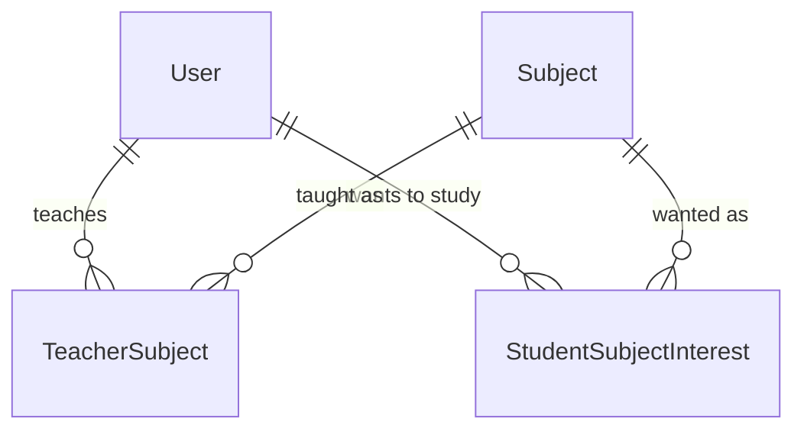

# curriculum — architecture

What kaleem teaches, and who teaches or wants to study it. Today that is exactly three
tables: a `Subject` catalogue plus the teacher and student links to it. `curriculum` exists
this early only because Phase C's matcher needs subject as an input; the roadmap's fuller
scope (`Course`, `Unit`, `Lesson`) lands in a later phase.

Spec: `docs/superpowers/specs/2026-09-04-phase-c0-matching-inputs-design.md` · ADR-0031 ·
Status: shipped (Phase C, C0).

## Data model

- **Subject** — `slug` (unique), `name`, `is_active`, timestamps. Admin-managed, so adding
  a fourth subject is a row rather than a migration and a deploy. Seeded with `quran`,
  `tafsir` and `arabic` by migration `0002_seed_subjects`, which uses `update_or_create` so
  it converges on a database where a row was added by hand instead of failing the deploy.
  Retiring a subject means `is_active = False`, never a delete — existing links stay
  readable.
- **TeacherSubject** — `user` → `subject`, unique together. A teacher teaches many.
- **StudentSubjectInterest** — `user` → `subject`, unique together. A student wants many.

Both links are **rows, not a JSON blob on a profile** (rule #3) and **many-over-time, not a
`OneToOneField`** (rule #7). Both key to `AUTH_USER_MODEL` **by string**, which is what lets
this module reference users without importing `identity`'s models.

## Public API

Everything outside the module goes through `kaleem.curriculum.services`. Callers never touch
the models.

| Service | Does |
| --- | --- |
| `list_active_subjects()` | Every `is_active` subject |
| `get_teacher_subjects(user_id)` | The teacher's slugs, sorted |
| `set_teacher_subjects(user_id, slugs)` | Replaces the whole set; returns what was stored |
| `get_student_subjects(user_id)` | The student's slugs, sorted |
| `set_student_subjects(user_id, slugs)` | Replaces the whole set; returns what was stored |

A symmetric quartet on purpose: the dashboard hooks mirror these names exactly, so a reader
can move between the two repos without translating.

**`_resolve` runs before the delete inside `_set`.** Validation first is not incidental — the
obvious ordering (delete, then insert what resolves) wipes a user's existing subjects on its
way to rejecting a payload with one bad slug, and passes every other test. Pinned by
`test_a_rejected_payload_leaves_the_previous_set_intact`.

Unknown or inactive slugs raise `platform.exceptions.ValidationError` rather than being
dropped silently: a typo'd slug that vanished would look to the caller like a successful save
of a smaller set (rule #8).

## API surface

All under `/api/v1/curriculum/`, mounted through `config.api_router` (ADR-0029).

| Method | Path | Who |
| --- | --- | --- |
| `GET` | `subjects/` | any authenticated user |
| `GET` `PUT` | `me/teacher-subjects/` | teacher (403 otherwise) |
| `GET` `PUT` | `me/student-subjects/` | student (403 otherwise) |

**Two role-explicit paths rather than one `/me/subjects/`.** A person may hold both profiles,
so a single endpoint would have to guess which set the caller meant, or reject the ambiguity
with a 400 that has no correct follow-up. Two paths make the dual-role case ordinary.

There is no shared base class behind the two views. An earlier draft had one; its entire
content was stubs that existed to be overridden, and covering them meant a test reaching into
private members. Two explicit views duplicate three lines per verb and name the table they
touch.

## Boundaries

`curriculum` depends on `identity` only, and only through `identity.services` plus the
`AUTH_USER_MODEL` string. Two import-linter contracts hold it there:

- `curriculum imports no business modules except identity`
- `curriculum does not reach past identity's public API` — `allow_indirect_imports`, so the
  legitimate `curriculum.services → identity.services → identity.models` chain stays legal
  while a direct model import fails.

Both were written **before** any code and the second was verified by breaking it. That is the
lesson from `scheduling`, which shipped without the mirror and where a direct
`from kaleem.identity.models import User` passed CI until 2026-09-04.

Note the arrow's direction is load-bearing in the other direction too: **`identity` may not
import `curriculum` at all.** This is why `seed_e2e`, which lives in `identity`, cannot reset
a teacher's subjects — the e2e specs converge their own fixture instead.

## Deliberately not here

- **Matching.** No `TeacherAssignment`, no ranking. Phase C1.
- **Booking, sessions, quota, video.** Phases C2 and C3.
- **`Course` / `Unit` / `Lesson`** — the roadmap's real curriculum scope.
- **Subject proficiency or level** (beginner vs advanced Arabic). A matching refinement; C1
  adds it if the ranking needs it.
