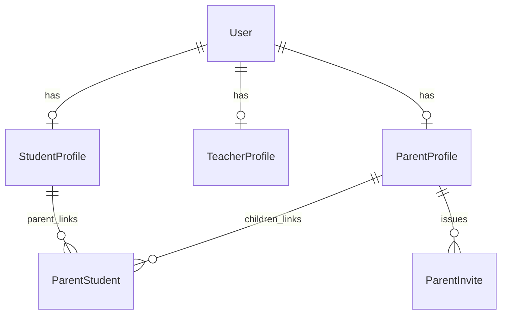

# identity — architecture

The foundational module: one `User` plus optional profile tables, email-based auth via
django-allauth, and the parent↔child relationship. Every other module depends on it.

Spec: `docs/superpowers/specs/2026-06-08-identity-module.md` · Status: shipped (Phase A).

## Data model

- **User** — single identity. Email is the username (`USERNAME_FIELD = "email"`), no
  `username` field. Roles are *not* on the user; they are expressed by which profile
  tables exist. `is_staff=True` ⇒ admin. A user may hold multiple profiles.
- **StudentProfile / TeacherProfile / ParentProfile** — `OneToOne` to User. Carry
  role-specific data (student: time + teacher-gender preferences; teacher: availability,
  `is_in_pool`; parent: none yet, a marker).
- **ParentStudent** — many-over-time link, one parent → many children (`unique_together`).
  Deliberately a FK link table, not a `OneToOne`.
- **ParentInvite** — a 24h code (`INVITE_TTL`) a parent gives an existing student so the
  student self-links. Issuing a new invite expires any prior unused one.

## Public API (`identity/services.py`)

All inter-module calls enter here — no other module may import identity's models
(enforced by import-linter, contract in `pyproject.toml`).

| Function | Purpose |
| --- | --- |
| `register_user(full_name, email, password, account_type)` | Adult student/parent + initial profile |
| `create_child(parent_user_id, full_name, preferences)` | Child User (placeholder email, unusable password) + StudentProfile + link |
| `set_child_password(parent_user_id, student_profile_id, password)` | Parent sets a child's login password |
| `create_invite(parent_user_id)` / `accept_invite(student_user_id, code)` | Parent↔child self-linking |
| `set_student_profile(...)` | Onboarding preferences |
| `create_teacher_account(email, full_name)` | Admin-driven; unusable password + password-set email, email pre-verified |
| `get_profile_types`, `get_children`, `is_parent_of`, `get_*_profile`, `get_user` | Reads |

Errors are typed (`platform.exceptions.ValidationError` / `NotFoundError`) — never bare
`Exception`. Write operations are `@transaction.atomic`.

## Auth & HTTP (`identity/api/`)

- Session cookies + real CSRF, same-origin. No JWT. allauth handles email verification
  (mandatory) and password reset; landing pages live under `/accounts/`.
- Endpoints under `/api/identity/`: `register/`, `login/`, `logout/`, `me/` (GET+PATCH),
  `me/student-profile/`, `children/`, `children/<id>/set-password/`, `invites/`,
  `invites/accept/`.
- Login is refused (400) until the email is verified. Authenticated mutations require a
  CSRF token (403 without). Anonymous `register`/`login` are not CSRF-checked — standard
  DRF `SessionAuthentication` behaviour (CSRF is enforced only on session-authenticated
  requests).

## v1 decisions worth knowing

- **Children have no email of their own.** `create_child` assigns a placeholder
  `child.<uuid>@placeholder.kaleem` and an unusable password; the parent sets a real
  password later via `set_child_password`. No verification email is sent for children.
- **Teachers are admin-created**, not self-registered, and start out of the matching pool
  (`is_in_pool=False`). Admin UX lives in the React dashboard, not Django admin
  (ADR-0013); Django admin is internal-only.
