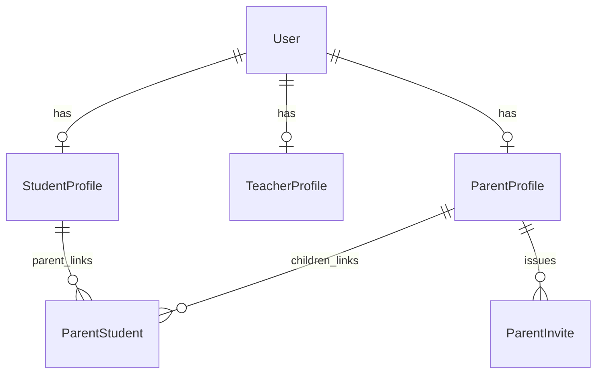

# identity — architecture

The foundational module: one `User` plus optional profile tables, email-based auth via
django-allauth, and the parent↔child relationship. Every other module depends on it.

Spec: `docs/superpowers/specs/2026-06-08-identity-module.md` · Status: shipped (Phase A).

## Data model

- **User** — single identity. Email is the username (`USERNAME_FIELD = "email"`), no
  `username` field. Roles are *not* on the user; they are expressed by which profile
  tables exist. `is_staff=True` ⇒ admin. A user may hold multiple profiles.
- **StudentProfile / TeacherProfile / ParentProfile** — `OneToOne` to User. Carry
  role-specific data (student: time + teacher-gender preferences; teacher: availability,
  `is_in_pool`; parent: none yet, a marker).
- **ParentStudent** — many-over-time link, one parent → many children (`unique_together`).
  Deliberately a FK link table, not a `OneToOne`.
- **ParentInvite** — a 24h code (`INVITE_TTL`) a parent gives an existing student so the
  student self-links. Issuing a new invite expires any prior unused one.

## Public API (`identity/services.py`)

All inter-module calls enter here — no other module may import identity's models
(enforced by import-linter, contract in `pyproject.toml`).

| Function | Purpose |
| --- | --- |
| `register_user(full_name, email, password, account_type)` | Adult student/parent + initial profile |
| `create_child(parent_user_id, full_name, preferences)` | Child User (placeholder email, unusable password) + StudentProfile + link |
| `set_child_password(parent_user_id, student_profile_id, password)` | Parent sets a child's login password |
| `create_invite(parent_user_id)` / `accept_invite(student_user_id, code)` | Parent↔child self-linking |
| `set_student_profile(...)` | Onboarding preferences |
| `create_teacher_account(email, full_name)` | Admin-driven; unusable password + password-set email, email pre-verified |
| `add_email_address(user_id, email, current_password)` | Add a new **unverified** address (password re-auth, uniqueness + cap checks); alerts current primary |
| `set_primary_email(user_id, email_id, current_password)` | Promote a **verified** address to primary (swaps `User.email`); alerts previous primary |
| `remove_email_address(user_id, email_id)` / `list_email_addresses(user_id)` | Remove a non-primary address / list addresses |
| `get_profile_types`, `get_children`, `is_parent_of`, `get_*_profile`, `get_user` | Reads |

Errors are typed (`platform.exceptions.ValidationError` / `NotFoundError`) — never bare
`Exception`. Write operations are `@transaction.atomic`.

## Auth & HTTP (`identity/api/`)

- Session cookies + real CSRF, same-origin. No JWT. allauth handles email verification
  (mandatory) and password reset; landing pages live under `/accounts/`.
- URL-path versioned under `/api/v1/` (ADR-0017). Endpoints: `register/`,
  `resend-verification/`, `verify-email/`, `login/`, `logout/`, `me/` (GET+PATCH),
  `me/emails/` (GET+POST), `me/emails/<id>/primary/`, `me/emails/<id>/` (DELETE),
  `me/student-profile/`, `children/`, `children/<id>/set-password/`, `invites/`,
  `invites/accept/`. Browsable docs at `/api/v1/docs/` (staff-only off local dev).
  `PATCH /me/` updates `full_name` only — it cannot change the email (see below).
- Login is refused (400) until the email is verified. Authenticated mutations require a
  CSRF token (403 without). Anonymous `register`/`login` are not CSRF-checked — standard
  DRF `SessionAuthentication` behaviour (CSRF is enforced only on session-authenticated
  requests).
- **Resend verification** (`POST resend-verification/`, `{email}`): re-sends the
  confirmation link if an unverified account exists. Always returns 200 (never reveals
  whether an email is registered) and is throttled per-email (`EmailScopedThrottle`,
  5/hour) so it can't be used to email-bomb a recipient.

## Email addresses (ADR-0022)

A user may hold multiple `EmailAddress` rows (allauth's table — no new model). `User.email`
(unique, the `USERNAME_FIELD`) is **derived state**: it always tracks the `primary`
address and is mutated only by allauth's `set_as_primary()`, never by a manual write.

Lifecycle — "change my email" is **add → verify → set-primary**:

1. `POST /me/emails/` adds a new address **unverified** and non-primary. It requires the
   current password (re-auth), rejects duplicates / addresses owned by another user, and
   is capped (`ACCOUNT_MAX_EMAIL_ADDRESSES`, default 5). Existing addresses are untouched,
   so login and the verification gate keep working off the old verified address.
2. The new address is verified through the existing `verify-email/` confirm-by-key flow.
   Confirming only sets `verified=True`; it does **not** auto-promote.
3. `POST /me/emails/<id>/primary/` promotes a **verified** address to primary (password
   re-auth), swapping the login identity. The previous primary remains a verified
   secondary address that still authenticates.

A **security alert** email goes to the current primary on add, and to the *previous*
primary on promotion (so the real owner is warned of an unauthorised change). The primary
address cannot be deleted (`DELETE /me/emails/<id>/`); promote another first. The old
insecure `PATCH /me/ {email}` path was removed — email changes go only through these
endpoints.

## v1 decisions worth knowing

- **Children have no email of their own.** `create_child` assigns a placeholder
  `child.<uuid>@placeholder.kaleem` and an unusable password; the parent sets a real
  password later via `set_child_password`. No verification email is sent for children.
- **Teachers are admin-created**, not self-registered, and start out of the matching pool
  (`is_in_pool=False`). Admin UX lives in the React dashboard, not Django admin
  (ADR-0013); Django admin is internal-only.
