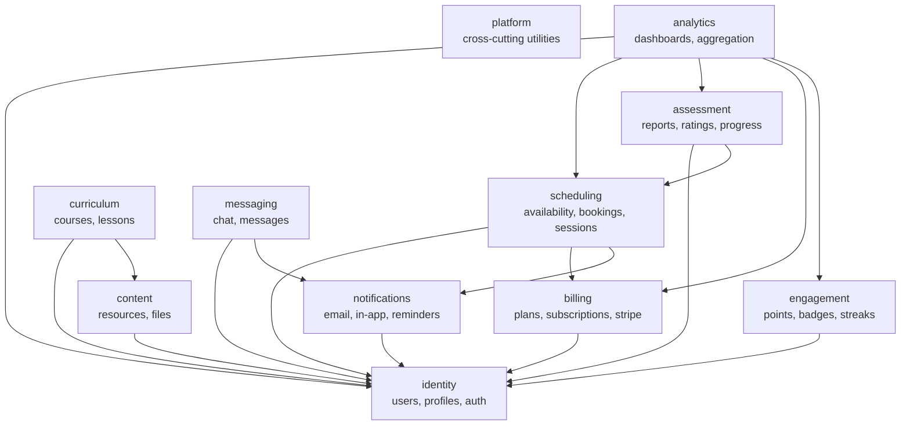

# kaleem Architecture Overview

## Module map

## Boundary rules

1. No business module imports another module's models
2. All inter-module calls go through `<module>/services.py`
3. `analytics` is read-only — it never writes to other modules
4. `platform` is imported by all, imports from none
5. No circular dependencies at the module level
6. Enforced by `import-linter` in CI

## Current state

**Phase 0** — only `platform` module exists. All other modules are planned for later phases.
