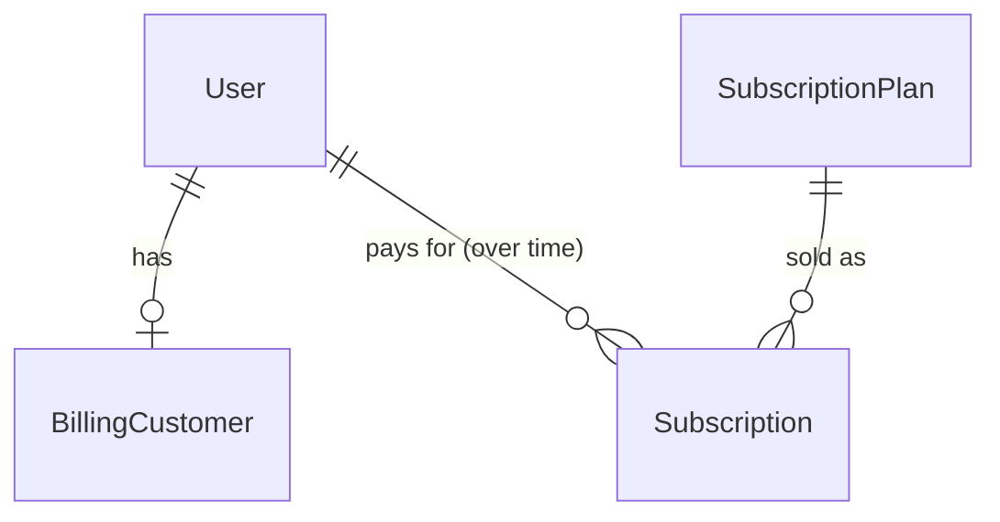

## Goal

Let a parent or adult student **subscribe to a monthly plan, pay with Stripe, and become
entitled** to sessions — and let them see and cancel that subscription. This is Phase B's
B1 slice: the subscription + payment + entitlement core that every later Phase B feature
(scheduling, sessions) depends on. Stripe owns the recurring billing; our `billing` module
mirrors Stripe's state via webhooks and exposes a single `is_entitled_to(user, capability)`
service for other modules to gate on. Session-pool *consumption* (how many sessions are
left this cycle) and teacher payroll are **out of scope** — B1 answers "is this user
covered?", not "how many sessions remain?".

Business model is fixed by the product spec (`2026-06-08-kaleem-product-spec.md`):
- **Individual** — one adult student, 4 sessions/month.
- **Family** — one parent, 4 sessions per child/month in a shared pool.
- Prices are **admin-configurable, stored in the DB**, monthly auto-renewing.
- **Stripe** is primary (OQ-06), behind a provider interface so local methods can be added later.

Decisions taken during brainstorming: **no free trial** (pay immediately); **cancel at
period end** (keep access through the paid month, no refund/proration).

## User flow

**Subscribe (adult student → Individual, parent → Family):**
1. Authenticated user opens the billing/pricing page. It lists the plan(s) their role can buy.
2. User clicks **Subscribe** on a plan → backend creates a Stripe Checkout Session → browser
   redirects to Stripe's hosted checkout.
3. User enters card details on Stripe and confirms.
4. Stripe redirects back to our **success URL**. Because the confirming webhook is
   asynchronous, the return page shows a **"finishing up…"** state and polls
   `GET me/subscription/` until the subscription reads `active` (with a timeout fallback
   message telling them it may take a moment / to refresh).
5. Once active, the user is **entitled** (`is_entitled_to(user, BOOK_SESSION) == True`). For a
   Family plan, each linked child is now entitled too (inherited).

**Cancel:**
1. On the billing management view the user clicks **Cancel** → confirm dialog explaining
   "your access continues until the period-end date".
2. Backend flags `cancel_at_period_end` on the Stripe subscription; the webhook mirrors it.
   Status shows "cancels on `{period_end}`"; access continues until then, then the subscription lapses
   and entitlement ends.

**Error / edge cases:**
- User already has a current active subscription → `POST checkout/` returns a typed 400
  ("You already have an active subscription").
- Buyer's role doesn't fit the plan (e.g. a non-parent buying Family) → typed 403/400.
- User abandons Stripe checkout → Stripe redirects to the **cancel URL**; no subscription is
  created; the pricing page is shown again.
- Payment fails on renewal → Stripe emits `invoice.payment_failed` → subscription mirrored as
  `past_due` → **not entitled** (dunning UX beyond the status flag is deferred; see Out of scope).
- Child/student attempts to view billing → they don't; entitlement is inherited from the parent.

## Data model delta

New module `kaleem.billing` with four tables. User references use
`settings.AUTH_USER_MODEL` (same pattern as `scheduling`) — **no import of identity models**.

- **SubscriptionPlan** (admin-CRUD via Django admin) —
  `plan_type` (INDIVIDUAL | FAMILY), `sessions_per_cycle` (per-student for Individual,
  per-child for Family), `stripe_price_id` (a recurring Stripe Price — the **charge source of
  truth**), `display_amount` (integer minor units) + `currency` (shown on the pricing page;
  validated against the Stripe Price on save), `is_active`, timestamps.
  Plan **display name/description come from frontend i18n keyed on `plan_type`** — no bilingual
  copy stored in the DB.
- **BillingCustomer** — OneToOne `user` → `stripe_customer_id`. One Stripe customer per user,
  created lazily on first checkout.
- **Subscription** (many-over-time per user) — `user` (the payer), `plan` FK,
  `stripe_subscription_id` (unique), `status` (mirrors Stripe: `active` / `past_due` /
  `canceled` / `incomplete` / `incomplete_expired` / `unpaid`), `current_period_end` (datetime),
  `cancel_at_period_end` (bool), timestamps. A user may accumulate rows over time (resubscribe
  after lapse); service logic enforces at most one *current* active subscription per user.
- **StripeEventLog** — `stripe_event_id` (unique), `event_type`, `received_at`, `processed_at`
  (nullable). Idempotency ledger: a webhook whose event id is already present + processed is a
  no-op.

**Identity addition (required):** `identity.services.get_parent_user_ids(student_user_id) ->
list[int]` — resolve the parent(s) of a student for Family-plan entitlement chaining. Small,
tested, keeps `billing` out of identity's models.

## API delta

New endpoints under `/api/v1/billing/`. Session auth + CSRF like the rest of the API, **except
the webhook** (see below). Errors are typed (`platform.exceptions`), never bare.

- **`GET plans/`** → `[{ id, plan_type, sessions_per_cycle, display_amount, currency }]`
  (all active plans; authed). The UI picks the plan matching the caller's role; role fitness is
  **enforced server-side** at checkout (below), so listing all plans is safe.
- **`POST checkout/`** `{ plan_id }` → `{ checkout_url }`.
  Validates buyer role fits plan, via identity services:
  - **Family ⇒** buyer has a `ParentProfile`.
  - **Individual ⇒** buyer has a `StudentProfile` **and is not linked as a child to any parent**
    (`get_parent_user_ids(buyer) == []`) — a child is covered by a parent's Family plan and may
    not self-subscribe.
  And buyer has no current active subscription. Ensures a `BillingCustomer`, creates a Stripe
  Checkout Session
  (`mode=subscription`, the plan's `stripe_price_id`, success/cancel URLs from `FRONTEND_URL`),
  returns the hosted URL.
- **`POST webhook/`** — **CSRF-exempt, unauthenticated by session; authenticated by Stripe
  signature** (`STRIPE_WEBHOOK_SECRET`). The *only* CSRF-exempt endpoint in the codebase;
  justified + documented in the ADR and an inline comment (it is server-to-server, signed — not
  "CSRF turned off"). Idempotent via `StripeEventLog`. Handles:
  - `checkout.session.completed` → create/activate the `Subscription`.
  - `customer.subscription.updated` → sync `status`, `current_period_end`, `cancel_at_period_end`.
  - `customer.subscription.deleted` → mark lapsed (`canceled`).
  - `invoice.paid` → renew (advance `current_period_end`, ensure `active`).
  - `invoice.payment_failed` → `past_due`.
  Unknown/irrelevant event types are logged and acked (200) without effect.
- **`GET me/subscription/`** → current subscription + history for the caller
  `{ current: {...} | null, history: [...] }`.
- **`POST me/subscription/cancel/`** → sets `cancel_at_period_end` on the Stripe subscription via
  the provider (caller must be the payer). The webhook mirrors the change back.

**Provider abstraction:** a `PaymentProvider` Protocol — `ensure_customer(user)`,
`create_checkout_session(...)`, `cancel_at_period_end(subscription_id)`,
`verify_and_parse_webhook(payload, signature)`. `StripeProvider` implements it; **nothing else
in `billing` imports `stripe`.** The provider is selected by config (OQ-06 future local method).

## Frontend

Replaces the non-functional scaffold `/billing` placeholder (dashboard #18) with the real slice.

- **Routes** (TanStack Router, under `_authed`):
  - `/billing` — pricing + management. Visible to **parents** (Family) and **adult students**
    (Individual). Children/teachers don't see a billing entry in nav.
  - Success/cancel return handling on `/billing` (query param, e.g. `?checkout=success|cancelled`).
- **Components / states:**
  - `PlanList` — plans from `GET plans/`; `Subscribe` button → `POST checkout/` → redirect
    (`window.location.assign(checkout_url)`). Loading / empty (no active plans) / error states.
  - `CheckoutReturn` — on `?checkout=success`, an **"finishing up…"** state that polls
    `GET me/subscription/` until `active`, then shows success; timeout fallback after N tries.
    On `?checkout=cancelled`, a neutral "checkout cancelled" notice back to the plan list.
  - `SubscriptionCard` — current plan, status ("active" / "cancels on `{period_end}`" / "past due"),
    renewal date, subscription history; **Cancel** button → confirm dialog → `POST cancel/`.
- **API calls** via `src/lib/api.ts`: `listPlans`, `createCheckout`, `getMySubscription`,
  `cancelSubscription`.
- **Baseline (ADR-0020):** en + ar with full RTL; jest-axe per component; role-gated nav.
- **"Done" =** built, deployed to staging, verified in the browser end-to-end with a Stripe
  **test card** (`4242 4242 4242 4242`).

## Module boundaries

- **Owner:** `billing`. Public API = `billing/services.py`; import-linter contract added
  (billing may not import other modules' models; others call `billing.services`).
- **Calls out to:** `identity.services` only (`get_parent_profile`, `get_student_profile`,
  `is_parent_of`, and the new `get_parent_user_ids`). Stripe only via `PaymentProvider`.
- **Called by (later):** `scheduling` will call `billing.services.is_entitled_to(user,
  Capability.BOOK_SESSION)` when it introduces booking. No scheduling changes in this spec.
- **Entitlement rule** — `is_entitled_to(user, capability)`:
  - `Capability` enum, starts with `BOOK_SESSION`.
  - True if the user has a **paid-through** subscription — status `active`, OR
    (`cancel_at_period_end`/`canceled` **and** `current_period_end` > now).
  - **Chaining:** a student is entitled if any parent (`get_parent_user_ids`) holds a
    paid-through **Family** subscription.
  - `past_due` / lapsed ⇒ not entitled.
- **New events:** none in B1 (no event bus yet; scheduling will call the service directly).

## Out of scope

- **Session-pool consumption / quotas** (how many of the 4 sessions are used/left, Family
  allocation across children) — belongs to the sessions/scheduling slice. B1 stores
  `sessions_per_cycle` on the plan but does **not** track or decrement usage.
- **Teacher payroll** (Phase G).
- **Free trial**, **refunds/proration** (cancel is period-end only).
- **Stripe billing portal / card-update UI** and **dunning UX** beyond mirroring `past_due`
  (a failed-payment retry/notice flow is a follow-up).
- **Live Stripe keys / production billing** — staging uses Stripe **test mode**; go-live is a
  launch task.
- **Programmatic plan/price creation in Stripe** — for B1 an admin creates the recurring Price
  in Stripe (test mode) and pastes the `stripe_price_id` + matching display amount into the plan.

## Test plan

TDD, **100% line + branch** (D3). Stripe is faked at the `PaymentProvider` boundary — unit
tests never hit the network.

**Happy path:**
- `POST checkout/` returns a checkout URL for a valid plan + eligible buyer; a `BillingCustomer`
  is created once and reused.
- `checkout.session.completed` webhook creates an `active` Subscription; `GET me/subscription/`
  then shows it as current.
- `is_entitled_to(payer, BOOK_SESSION)` is True while active; a linked **child is entitled**
  under a parent's active Family plan.
- `POST cancel/` sets `cancel_at_period_end`; entitlement persists until `current_period_end`,
  then lapses.

**Edge / failure cases (must pass):**
- Webhook **signature invalid** → 400, no state change.
- Webhook **idempotency** — same `stripe_event_id` delivered twice → second is a no-op.
- Checkout when the user **already has an active subscription** → typed 400.
- Checkout with a **role/plan mismatch** (non-parent buys Family; child buys anything) → typed
  403/400.
- Entitlement matrix: Individual active / canceled-but-paid-through / lapsed; Family child
  inherit vs. no parent subscription; `past_due` ⇒ not entitled.
- `invoice.payment_failed` → `past_due` → not entitled; `invoice.paid` → back to `active`.

**E2E:** the hosted-Stripe redirect cannot run in Playwright. CI e2e covers the pre-checkout UI
and the post-webhook **entitled** state against a mocked backend. The true
card → checkout → webhook path is a **documented manual staging test** (Stripe test card +
Stripe CLI `stripe listen` webhook forwarding). This limitation is recorded in `ISSUES.md`.

## Open questions

_All blocking product questions were resolved during brainstorming (scope = Roadmap B1; no
trial; cancel at period end; Stripe hosted Checkout + webhook-mirrored state; provider
abstraction). Non-blocking, deferred (not required to implement B1):_

- **OQ-07** (product spec) — Family price relative to Individual × N. Admin sets it in the DB;
  does not block implementation.
- **OQ-02** (product spec) — teacher pay rate. Payroll is out of scope (Phase G).
- Whether the marketing site later shows a **public** pricing page (B1's pricing page is authed,
  in the dashboard). Revisit with marketing.
